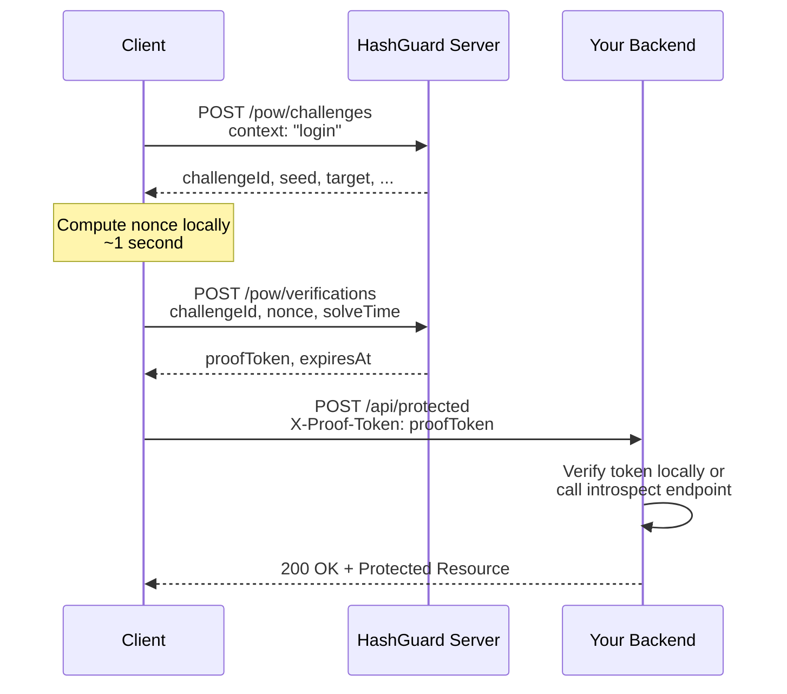

# Hashguard Client SDK

Official TypeScript/JavaScript client for the [Hashguard](https://github.com/vientorepublic/hashguard) Proof-of-Work CAPTCHA service.

Defend your application against bot attacks by requiring clients to solve a SHA-256 computational puzzle before accessing protected resources.

## Features

- **Simple API**: Issue a challenge → Solve locally → Verify with server in 3 steps
- **Cryptographically Sound**: SHA-256 based PoW (same as Bitcoin mining)
- **Optional WASM Acceleration**: Rust/WASM hash + solver path for higher throughput
- **Zero Dependencies**: Uses only Node.js built-ins and Fetch API
- **Adaptive Difficulty**: Server automatically adjusts difficulty based on request rate
- **Fast Solver**: Optimized nonce search with progress reporting
- **Full TypeScript Support**: Complete type definitions included
- **Works Everywhere**: Node.js, Bun, Deno, and modern browsers
- **JWT Proof Token**: Server issues HMAC-SHA256 (`HS256`) signed JWT proof tokens

## Installation

```bash
npm install hashguard-client
```

## Quick Start

```typescript
import { HashGuardClient } from 'hashguard-client';

const client = new HashGuardClient({
  baseUrl: 'https://pow.example.com',
});

// Complete workflow: issue → solve → verify
const result = await client.execute({ context: 'login' });

console.log('Proof token:', result.verification.proofToken);
console.log('Attempts needed:', result.solveResult.attempts);
console.log('Time spent:', result.solveResult.solveTimeMs, 'ms');
```

## API Reference

### HashGuardClient

#### Constructor

```typescript
const client = new HashGuardClient({
  baseUrl: 'https://pow.example.com',  // Required
  routePrefix?: 'v1',                  // Default: 'v1'
  timeout?: 10_000,                    // Default: 10 seconds
  headers?: { Authorization: '...' },  // Extra headers
});
```

#### Methods

##### `execute(context?: string, solverOptions?: SolverOptions): Promise<PowFlowResult>`

One-shot method combining issue → solve → verify:

```typescript
try {
  const result = await client.execute('login', {
    timeoutMs: 120_000,
    onProgress: (attempts) => console.log(`Tried: ${attempts}`),
  });

  // Send proof token to your backend
  const response = await fetch('/api/protected', {
    method: 'POST',
    headers: { 'X-Proof-Token': result.verification.proofToken },
  });
} catch (error) {
  if (error instanceof SolverTimeoutError) {
    console.error('Failed to solve challenge:', error.attempts, 'attempts');
  }
}
```

##### `issueChallenge(context?: string): Promise<Challenge>`

Request a new challenge from the server:

```typescript
const challenge = await client.issueChallenge('comment-post');
// Returns:
// {
//   challengeId: 'a1b2c3d4-...',
//   algorithm: 'sha256',
//   seed: 'deadbeef...',
//   difficultyBits: 20,
//   target: '00000fffff...',
//   issuedAt: '2026-03-16T10:00:00.000Z',
//   expiresAt: '2026-03-16T10:10:00.000Z'
// }
```

##### `solvePow(challengeId, seed, target, solverOptions?): SolveResult`

Solve a challenge locally (used by `execute` internally):

```typescript
import { solvePow } from 'hashguard-client';

const result = solvePow(challenge.challengeId, challenge.seed, challenge.target, {
  maxAttempts: 50_000_000,
  timeoutMs: 120_000,
  onProgress: (attempts) => updateProgressBar(attempts),
});

// {
//   nonce: '52847',
//   hash: 'f234a9b1...',
//   attempts: 52848,
//   solveTimeMs: 845
// }
```

##### `verifyChallenge(challengeId, nonce, solveTimeMs?): Promise<VerificationResult>`

Submit the solved nonce to the server:

```typescript
const verification = await client.verifyChallenge(
  challenge.challengeId,
  solveResult.nonce,
  solveResult.solveTimeMs
);

// {
//   proofToken: 'eyJ...eyJ...sig',
//   expiresAt: '2026-03-16T10:05:00.000Z'
// }
```

##### `introspectToken(proofToken, consume?): Promise<IntrospectResult>`

Verify a proof token on your backend:

```typescript
// Call this from your API server
const tokenInfo = await client.introspectToken(
  request.headers['x-proof-token'],
  true // consume=true is default; set false for read-only inspection
);

if (tokenInfo.valid) {
  console.log('Client IP:', tokenInfo.subject);
  console.log('Context:', tokenInfo.context);
  // Proceed with the protected action
} else {
  // Token invalid, expired, or already used
}

// Note: if the server cannot safely verify token usage state,
// introspection may fail with 503 / POW_TOKEN_STATE_UNAVAILABLE.
```

## Types

```typescript
interface Challenge {
  challengeId: string; // UUID
  algorithm: 'sha256';
  seed: string; // 32-byte random hex
  difficultyBits: number; // Typically 20–26
  target: string; // 64-char lowercase hex
  issuedAt: string; // ISO 8601
  expiresAt: string; // ISO 8601
}

interface VerificationResult {
  proofToken: string; // Single-use proof token
  expiresAt: string; // ISO 8601
}

interface IntrospectResult {
  valid: boolean;
  subject?: string; // Client IP (if valid)
  context?: string; // Original context (if valid)
  issuedAt?: string; // ISO 8601
  expiresAt?: string; // ISO 8601
}

interface SolveResult {
  nonce: string; // Winning nonce value
  hash: string; // SHA-256 of challengeId:seed:nonce
  attempts: number; // Total nonces tried
  solveTimeMs: number; // Wall-clock time
}

interface SolverOptions {
  maxAttempts?: number; // Default: 50_000_000
  timeoutMs?: number; // Default: 120_000
  progressInterval?: number; // Default: 100_000
  onProgress?: (attempts: number) => void;
}
```

## Error Handling

```typescript
import { HashGuardError, SolverTimeoutError, HashGuardClient } from 'hashguard-client';

try {
  const result = await client.execute('login');
} catch (error) {
  if (error instanceof SolverTimeoutError) {
    // Client couldn't solve the challenge within time/attempt limits
    console.error(`Gave up after ${error.attempts} attempts (${error.elapsedMs}ms)`);
  } else if (error instanceof HashGuardError) {
    // Server returned an error
    console.error(`Server error [${error.code}]: ${error.status}`);
  } else {
    // Unexpected error
    throw error;
  }
}
```

## How It Works

1. **Issue Challenge**: Client requests a new challenge. Server generates a random seed and calculates a difficulty-based target.
2. **Solve Locally**: Client performs SHA-256 hashing in a loop: `SHA-256(challengeId:seed:nonce)` until finding a nonce where the hash is ≤ target (lexicographic).
3. **Verify & Receive Token**: Client submits the nonce. Server validates it and issues a single-use, expiring proof token.
4. **Use Proof Token**: Client includes the proof token in requests to your protected endpoints. Your backend calls `/introspect` to verify it's valid.

### Example Request Flow



## Browser Usage

HashGuard Client works in modern browsers with the Fetch API:

```html
<script type="module">
  import { HashGuardClient } from 'https://cdn.jsdelivr.net/npm/hashguard-client@latest/+esm';

  const client = new HashGuardClient({ baseUrl: 'https://pow.example.com' });

  const result = await client.execute('comment');

  // Send token to your backend
  const response = await fetch('/api/comment', {
    method: 'POST',
    headers: { 'X-Proof-Token': result.verification.proofToken },
    body: JSON.stringify({ text: 'My comment' }),
  });
</script>
```

## WASM Acceleration

Hashguard Client includes an optional Rust/WASM fast path for hashing and nonce search.

### Runtime Usage (Explicit Init)

```typescript
import { initHashGuardWasm, isWasmReady, solvePow } from 'hashguard-client';

// Required: call once at startup (safe to call multiple times)
const wasmOk = await initHashGuardWasm();
console.log('WASM enabled:', wasmOk, isWasmReady());

// Existing APIs use WASM only after successful init
const solved = solvePow(challenge.challengeId, challenge.seed, challenge.target);

const solvedWithEta = solvePow(
  challenge.challengeId,
  challenge.seed,
  challenge.target,
  {
    difficultyBits: challenge.difficultyBits,
    progressInterval: 25_000,
    onEstimate: (estimate) => {
      console.log('ETA phase:', estimate.phase);
      console.log('Hash rate:', Math.round(estimate.hashRate), 'H/s');
      console.log('Remaining ms:', estimate.estimatedRemainingMs);
    },
  }
);
```

Notes:

- If WASM artifacts are unavailable, `initHashGuardWasm()` returns `false` and SDK falls back to pure TypeScript implementation.
- WASM is not auto-initialized. You must call `initHashGuardWasm()` explicitly.
- Existing API surface remains unchanged (`solvePow`, `sha256hex`, `verifyProof`); acceleration is used only after initialization.
- When `onEstimate` is provided, the solver emits heuristic ETA snapshots derived from difficulty bits, observed hash rate, and current attempt/time budgets.
- For browser UX, run PoW in a Web Worker to avoid blocking the main thread.

### Solver ETA Callbacks

```typescript
import { solvePow } from 'hashguard-client';

solvePow(challenge.challengeId, challenge.seed, challenge.target, {
  difficultyBits: challenge.difficultyBits,
  progressInterval: 50_000,
  onEstimate: (estimate) => {
    if (estimate.phase === 'progress') {
      console.log('attempts:', estimate.attempts);
      console.log('hashRate:', estimate.hashRate);
      console.log('remaining:', estimate.estimatedRemainingMs);
    }
  },
});
```

`onEstimate` payload fields:

- `phase`: `progress`, `complete`, or `timeout`
- `usingWasm`: whether the active solver path is WASM-backed
- `difficultyBits`: explicit or inferred difficulty bits used by the estimate
- `hashRate`: observed throughput in hashes/second
- `estimatedRemainingMs`: heuristic remaining time based on observed throughput
- `estimatedCompletionAt`: estimated completion timestamp in epoch milliseconds
- `attemptProgress` / `timeProgress`: normalized budget consumption signals

### Build WASM Artifacts (SDK development)

```bash
npm run build:wasm
```

This compiles Rust sources under `crate/` and regenerates files under `src/wasm-pkg/`.

## Advanced Usage

### Retry Logic

```typescript
async function executeWithRetry(client, context, maxRetries = 3) {
  for (let i = 0; i < maxRetries; i++) {
    try {
      return await client.execute(context, { timeoutMs: 60_000 });
    } catch (error) {
      if (i === maxRetries - 1) throw error;
      console.warn(`Attempt ${i + 1} failed, retrying...`);
      // Server might have increased difficulty due to rate limiting
      await new Promise((r) => setTimeout(r, 1000 * (i + 1)));
    }
  }
}
```

### Custom Fetch Implementation

If you need to customize HTTP behavior (e.g., custom agent for proxies), subclass the client:

```typescript
class CustomClient extends HashGuardClient {
  protected async request(url, options) {
    const customOptions = {
      ...options,
      agent: myCustomAgent,
    };
    return super.request(url, customOptions);
  }
}
```

## Server-Side Proof Token Validation

HashGuard Client provides utilities for validating and caching proof tokens on the server side.

### Local Token Validation (Fast Claims Check)

For quick validation without calling the HashGuard server:

```typescript
import { TokenValidator } from 'hashguard-client';

// Quick JWT format and expiration check
const validation = TokenValidator.validateLocal(proofToken, {
  maxAgeMs: 300_000, // Token must be less than 5 minutes old
});

if (!validation.valid) {
  return res.status(403).json({ error: validation.error });
}

console.log('Subject:', validation.subject); // Client IP
console.log('Context:', validation.context); // e.g., "login"
console.log('Issued at:', validation.issuedAt);
console.log('Expires at:', validation.expiresAt);
```

`validateLocal` only checks structure and claims. It does not verify JWT signature or single-use state.

### Stateless Signature Validation (Public-Key Verification)

For stateless verification that also checks the ES256 signature:

```typescript
import { HashGuardClient } from 'hashguard-client';

const client = new HashGuardClient({
  baseUrl: 'https://pow.example.com',
});

const validation = await client.validateTokenStatelessly(proofToken, 300_000);

if (!validation.valid) {
  return res.status(403).json({ error: validation.error });
}
```

If you already have the server's public JWK, you can also validate directly:

```typescript
import { TokenValidator } from 'hashguard-client';

const validation = await TokenValidator.validateStateless(proofToken, {
  verificationKey: publicJwk,
  maxAgeMs: 300_000,
});
```

Stateless validation confirms token integrity and claims without a network round-trip.
It still cannot determine whether a single-use token has already been consumed.
For definitive access control, keep using `introspectToken` on your backend.

### Server-Side Token Verification (Authoritative)

For definitive token validation with consumption (single-use):

```typescript
import { HashGuardClient } from 'hashguard-client';

const client = new HashGuardClient({
  baseUrl: 'https://pow.example.com',
});

// On your API backend
const proofToken = request.headers['x-proof-token'];

// Authoritative verification (consumes token)
const verification = await client.introspectToken(proofToken, true);

if (!verification.valid) {
  return res.status(403).json({ error: 'Invalid or expired proof token' });
}

// Proceed with protected action
```

Security-first defaults:

- `introspectToken(proofToken)` defaults to `consume=true`.
- `ResourceGuard.checkAccess(..., { consume })` also defaults to consuming tokens when `consume` is omitted.
- `ResourceGuard` uses stateless signature validation first when the client can fetch or is configured with a verification key.

### Resource Access Guard

For more sophisticated access control, use the `ResourceGuard` class:

```typescript
import { HashGuardClient, ResourceGuard } from 'hashguard-client';

const client = new HashGuardClient({ baseUrl: 'https://pow.example.com' });
const guard = client.createResourceGuard({
  maxEntries: 5000, // Cache up to 5000 tokens locally
  ttlMs: 300_000, // Cache for 5 minutes
});

// In a request handler:
const result = await guard.checkAccess(proofToken, {
  context: 'api-endpoint', // Must match challenge context
  consume: true, // Single-use token
  maxAgeMs: 600_000, // Max 10 minutes old
});

if (!result.allowed) {
  return res.status(403).json({ reason: result.reason });
}

// Access granted
res.json({ data: 'protected content' });
```

### Token Cache

Reduce server load by caching recent token validations:

```typescript
import { TokenCache } from 'hashguard-client';

const cache = new TokenCache(
  1000, // Max 1000 entries
  300_000, // 5-minute TTL
  60_000 // Auto-cleanup every 1 minute
);

// Check cache first
let validation = cache.get(proofToken);

if (!validation) {
  // Cache miss – authenticate with server
  validation = await client.introspectToken(proofToken, false);
  cache.set(proofToken, validation);
}

if (validation.valid) {
  // Grant access
}

// Clean up when done
cache.destroy();
```

### Token Introspection Methods

```typescript
import { TokenValidator } from 'hashguard-client';

const token = 'eyJ...';

// Extract claims without verification
const payload = TokenValidator.decodePayload(token);
const subject = TokenValidator.getSubject(token);
const context = TokenValidator.getContext(token);
const expiresAt = TokenValidator.getExpiresAt(token);
const issuedAt = TokenValidator.getIssuedAt(token);

// Check expiration
const expired = TokenValidator.isExpired(token, 10); // 10s clock skew
```

## End-to-End Example: Login Flow

```typescript
// === CLIENT SIDE ===
import { HashGuardClient } from 'hashguard-client';

const client = new HashGuardClient({ baseUrl: 'https://pow.example.com' });

// Start login - solve PoW
const powResult = await client.execute('login');

// Send to backend with credentials
const loginResponse = await fetch('/api/login', {
  method: 'POST',
  headers: {
    'Content-Type': 'application/json',
    'X-Proof-Token': powResult.verification.proofToken,
  },
  body: JSON.stringify({
    email: userEmail,
    password: userPassword,
  }),
});

if (loginResponse.ok) {
  const session = await loginResponse.json();
  localStorage.setItem('sessionToken', session.token);
}

// === SERVER SIDE ===
import { HashGuardClient, ResourceGuard } from 'hashguard-client';

const client = new HashGuardClient({ baseUrl: 'https://pow.example.com' });
const guard = client.createResourceGuard();

app.post('/api/login', async (req, res) => {
  const proofToken = req.headers['x-proof-token'];

  // Step 1: Verify PoW token
  const accessResult = await guard.checkAccess(proofToken, {
    context: 'login',
    consume: true,
  });

  if (!accessResult.allowed) {
    return res.status(403).json({ error: 'Proof-of-work verification failed' });
  }

  // Step 2: Verify credentials
  const user = await validateCredentials(req.body.email, req.body.password);
  if (!user) {
    return res.status(401).json({ error: 'Invalid credentials' });
  }

  // Step 3: Issue session token
  const sessionToken = await createSession(user);
  res.json({ token: sessionToken });
});
```

## Testing

Run tests:

```bash
npm test         # Run tests once
npm run test:watch # Watch mode
npm run test:cov   # Coverage report
npm run test:e2e   # Build + real WASM e2e verification
```

`test:e2e` validates the built SDK (`dist/index.mjs`) with real WASM initialization and PoW solving.

## License

MIT – see [LICENSE](./LICENSE)

## Contributing

Issues and PRs welcome at [GitHub](https://github.com/vientorepublic/hashguard-client)
